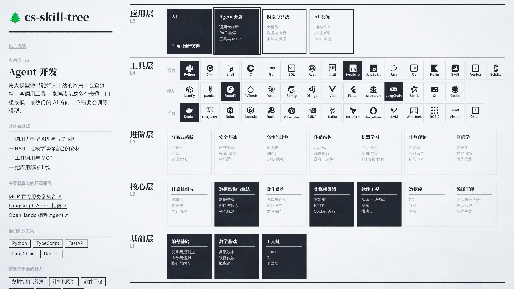

# 🌲 cs-skill-tree

简体中文 | [English](docs/README.en.md)

**想做 AI、后端、操作系统，该学什么？按方向倒推的计算机学习路线。**

选一个方向 → 亮起要学的语言、工具和能力 → 每项附公开课链接。

👉 https://theowang42.github.io/cs-skill-tree/

课程参考 [csdiy.wiki](https://csdiy.wiki/) · 内容在 `src/data/` · 本地运行 `npm ci && npm run dev`
